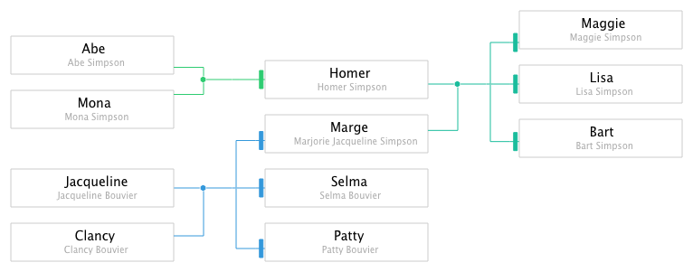
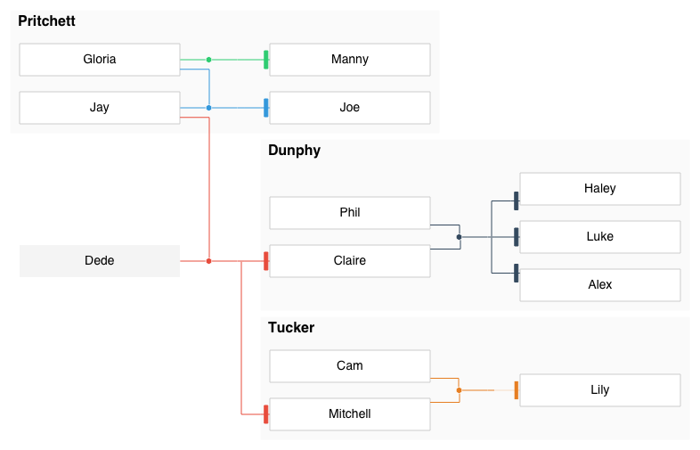
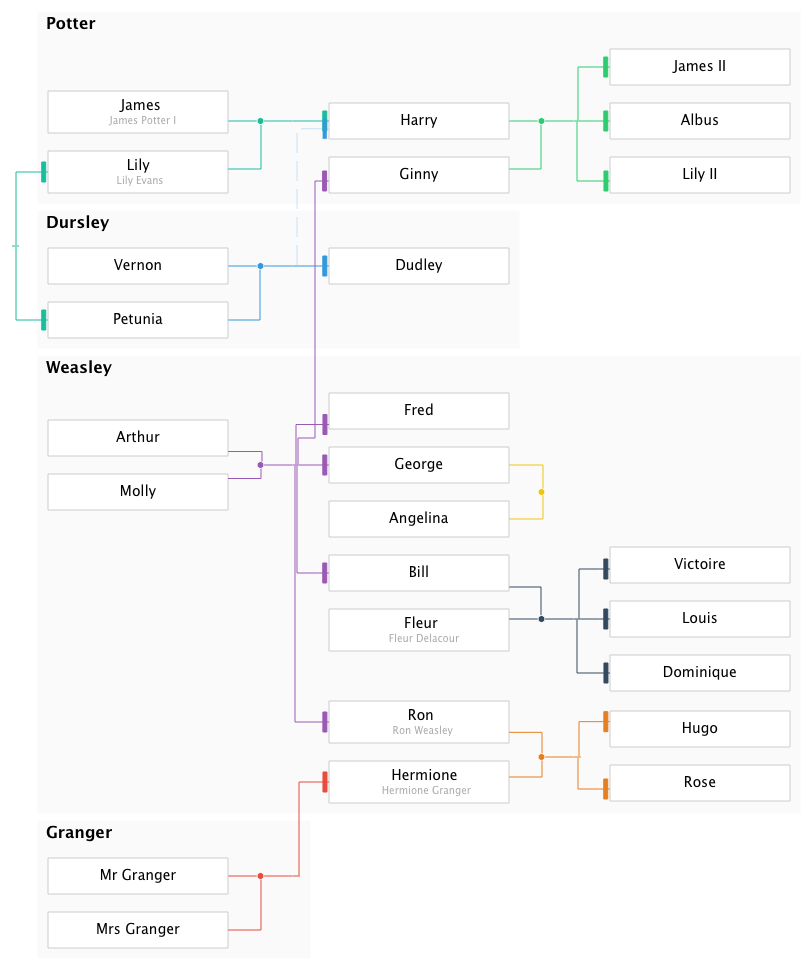
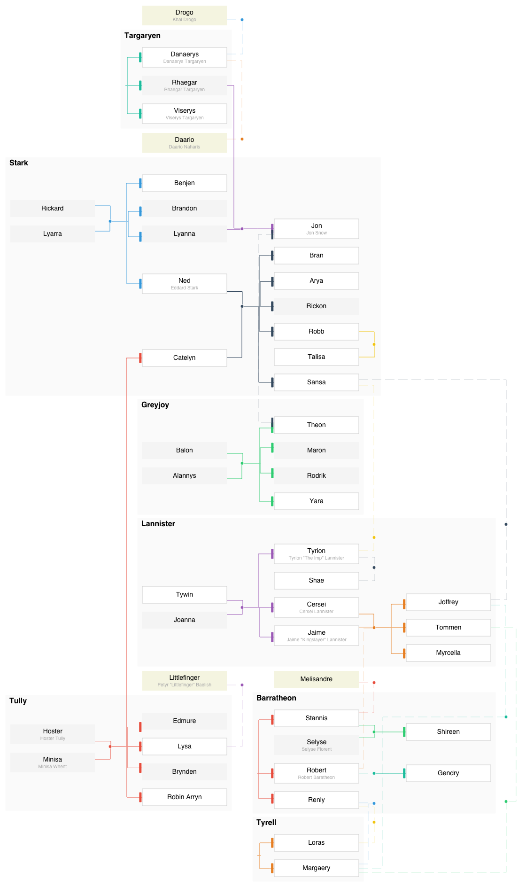

# kingraph

> 👪 Plots family trees using JavaScript and Graphviz

A family tree plotter with a very simple syntax. It probably doesn't cover everything [bigger tools](https://gramps-project.org/) do, but covers 90% of it for the sake of simplicity.


Installation
------------

```sh
npm install -g rstacruz/kingraph
# or
yarn global add rstacruz/kingraph  # via yarnpkg.com
```

This adds the `kingraph` command to your shell.

```sh
kingraph --help
kingraph family.yml > family.svg
```

Docker
------

You can also run `kingraph` with docker.

```sh
docker run --rm -v $(pwd):/data rstacruz/kingraph family.yml > family.svg
```

Examples
--------

Spoiler alerts, view at your own risk :)

<details>
<summary><b>Simpsons</b> (simple)</summary>

Source: *[simpsons.yml](examples/simpsons.yml)*

> 
</details>

<details>
<summary><b>Modern Family</b> (simple with houses)</summary>

Source: *[modernfamily.yml](examples/modernfamily.yml)*

> 
</details>

<details>
<summary><b>Harry Potter</b> (larger tree)</summary>

Source: *[potter.yml](examples/potter.yml)*

> 
</details>

<details>
<summary><b>Game of Thrones</b> (overly complicated)</summary>

Source: *[got.yml](examples/got.yml)*

> 
</details>

Getting started
---------------

A family tree is a [YAML](http://yaml.org/) file.

```yaml
families:
  - parents: [Marge, Homer]
    children: [Bart, Lisa, Maggie]
  - parents: [Lisa, Milhouse]
    children: [Zia]

people:
  Marge:
    fullname: Marjorie Bouvier Simpson
```

kingraph can give you `svg` (default), `png` or `dot` files.

```sh
kingraph family.yml > family.svg
kingraph family.yml -F png > family.png
kingraph family.yml -F dot > family.dot
```

See [Getting started](docs/getting_started.md) for more!

Documentation
-------------

For further reading:

- [Getting started](docs/getting_started.md)
- [Advanced usage](docs/advanced.md)
- [Schema](docs/schema.md)

## Thanks

**kingraph** © 2016+, Rico Sta. Cruz. Released under the [MIT] License.<br>
Authored and maintained by Rico Sta. Cruz with help from contributors ([list][contributors]).

> [ricostacruz.com](http://ricostacruz.com) &nbsp;&middot;&nbsp;
> GitHub [@rstacruz](https://github.com/rstacruz) &nbsp;&middot;&nbsp;
> Twitter [@rstacruz](https://twitter.com/rstacruz)

[MIT]: http://mit-license.org/
[contributors]: http://github.com/rstacruz/kingraph/contributors
